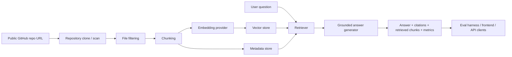

# RepoLens AI

RepoLens AI is a full-stack codebase onboarding assistant. You point it at a public repository, it indexes the code, retrieves the most relevant chunks for a question, and answers with file and line citations so you can check where the answer came from.

This project is meant to show more than "I can call an LLM API." It demonstrates the moving parts of a production-style AI system: ingestion, chunking, embeddings, retrieval, evaluation, observability, and deployment packaging.

## Why this project matters

When you join a new codebase, the hardest part is usually not writing code. It is finding the right files, understanding how modules fit together, and answering questions like:

- Where is the entrypoint?
- How does request logging work?
- Which file builds the API response?
- What config controls retrieval mode?

RepoLens AI is built to answer those questions from the indexed repository itself, not from general model knowledge.

## What it does

Given a repo URL, RepoLens AI:

1. clones the repository into a temporary workspace,
2. filters out junk like `node_modules`, `.git`, build folders, large lockfiles, images, and binaries,
3. chunks supported source files while preserving line numbers,
4. stores chunk metadata and embeddings,
5. retrieves relevant chunks with vector, BM25, or hybrid search,
6. generates a grounded answer,
7. returns the answer together with citations and debugging metadata.

## Supported file types

Current supported extensions:

- `.py`
- `.ts`
- `.tsx`
- `.js`
- `.jsx`
- `.java`
- `.rb`
- `.go`
- `.cpp`
- `.h`
- `.md`
- `.yml`
- `.yaml`
- `.json`

## Architecture



## Current stack

Backend:

- Python 3.11+
- FastAPI
- Pydantic
- SQLite metadata store
- in-memory vector store by default
- optional Chroma integration
- optional sentence-transformers embeddings
- optional Gemini / Vertex answer generation

Frontend:

- React
- TypeScript
- Vite
- plain CSS with a developer-tool style UI

Ops:

- JSON structured logging
- request IDs
- `/metrics` endpoint
- Dockerfiles
- `docker-compose`
- GitHub Actions CI

## Project layout

```text
backend/
  repolens/
    api/        FastAPI routes
    core/       config, logging, metrics
    services/   ingestion, chunking, retrieval, answering, evals
  tests/        backend tests
frontend/
  src/          React app
fixtures/
  sample_repo/  tiny demo repository used for evals
evals/
  sample_eval.json
scripts/
  run_sample_eval.py
docs/
  deploy-cloud-run.md
```

## No-cost mode vs paid mode

### No-cost local mode

The default local configuration is intentionally free:

- `EMBEDDING_PROVIDER=hashing`
- `VECTOR_STORE_PROVIDER=memory`
- `ANSWER_PROVIDER=extractive`

This means:

- no Gemini API calls,
- no Vertex AI calls,
- no Cloud Run deployment charges,
- no cloud dependency required to verify the core pipeline.

### Paid / optional mode

You only risk real usage charges if you explicitly switch to cloud-backed options such as:

- `GEMINI_API_KEY` with Gemini answer generation,
- `VERTEX_PROJECT_ID` with Vertex AI,
- Cloud Run deployment,
- Cloud Build / Artifact Registry usage.

If you stay on the default config, local verification costs `$0`.

## Secrets and security

- Real secrets should never be committed to this repository.
- `.env.example` contains placeholders only.
- Use a local `.env` file or exported shell variables for secrets.
- For deployment, use Secret Manager or platform-managed environment variables.
- The API currently assumes public repositories and local development. If you deploy this publicly, add auth before exposing indexing endpoints.

## Retrieval and answering modes

Chunking:

- sliding-window line chunking
- symbol-aware chunking where possible

Retrieval:

- vector search
- BM25 search
- hybrid search

Answer generation:

- `extractive` mode: free, offline-friendly, summarizes retrieved chunks
- `gemini` mode: optional cloud-backed answer generation

## Evaluation results

The project includes a sample fixture repository plus a 15-question eval set in `evals/sample_eval.json`.

Latest local run on the free/offline path:

| Metric | Result |
| --- | ---: |
| Retrieval recall@3 | 1.00 |
| Retrieval recall@5 | 1.00 |
| MRR | 0.867 |
| Answer contains score | 1.00 |
| Groundedness score | 1.00 |
| Hallucination flags | 0 |
| Failure rate | 0.00 |

Latency and cost on that tiny fixture:

| Scenario | Avg latency | Avg cost |
| --- | ---: | ---: |
| Free offline fixture eval | effectively 0 ms on the tiny demo repo | $0.00 |

That latency number is not meant to be a serious production benchmark. The sample repo is intentionally tiny and exists only to verify the pipeline end to end.

## How to run it locally

### 1. Clone the repo

```bash
git clone https://github.com/Arunteja27/repolens-ai.git
cd repolens-ai
```

### 2. Create the local Python environment

```bash
make setup
```

If you prefer the manual route:

```bash
python3 -m venv .venv
source .venv/bin/activate
.venv/bin/python -m pip install -e 'backend[dev]'
npm --prefix frontend install
```

### 3. Run the tests

```bash
make test
```

That runs:

- backend tests,
- frontend lint,
- frontend typecheck,
- frontend production build.

### 4. Run the sample eval

```bash
make eval
```

This indexes `fixtures/sample_repo`, runs the sample question set, and prints the evaluation summary.

### 5. Start the backend

```bash
make backend-dev
```

Backend endpoints:

- `GET /health`
- `GET /metrics`
- `POST /api/repos/index`
- `POST /api/query`
- `GET /api/repos/{repo_id}`
- `POST /api/evals/run`
- `GET /api/evals/{repo_id}`

### 6. Start the frontend

Open a second terminal in the repo and run:

```bash
make frontend-dev
```

Then open:

- frontend: `http://localhost:5173`
- backend: `http://localhost:8000`
- backend health: `http://localhost:8000/health`

## Can I give it any public repo link?

Mostly yes.

You can give it a public GitHub repo URL as long as:

- `git clone` can access it,
- the repo is not dominated by unsupported or binary file types,
- the repo is not so large that local indexing becomes impractical on your machine.

Good examples:

- a normal Python service
- a React / TypeScript app
- a medium-sized backend repo
- an open-source project with docs and code mixed together

Current limitations:

- private repos are not handled in the current flow,
- very large monorepos may be slow,
- unsupported file types are skipped,
- the default in-memory vector store is for local demo use, not long-term persistence.

## Example verification flow

If you want a fast manual demo after the servers are running:

1. Open `http://localhost:5173`.
2. Index a public repo.
3. Wait for the repo page to load.
4. Ask a question like:
   - `Where is the main entrypoint?`
   - `How does request logging work?`
   - `Which file handles authentication?`
5. Check that the answer includes:
   - file paths,
   - line ranges,
   - retrieved chunks underneath the answer.
6. Open the eval dashboard and run the sample eval set.

## Sample questions

- Where is the HTTP server bootstrapped?
- Which file attaches request logging middleware?
- Where are embeddings cached by chunk hash?
- Which file combines vector similarity and BM25?
- Where is the grounded answer prompt built?

## API examples

Index a repo:

```bash
curl -X POST http://localhost:8000/api/repos/index \
  -H "Content-Type: application/json" \
  -d '{"repo_url":"https://github.com/openai/openai-cookbook"}'
```

Query a repo:

```bash
curl -X POST http://localhost:8000/api/query \
  -H "Content-Type: application/json" \
  -d '{"repo_id":"REPO_ID_HERE","question":"Where is the main entrypoint?","retrieval_mode":"hybrid","top_k":6}'
```

## Docker and deployment

Local Docker workflow:

```bash
make docker
make dev
```

Cloud Run notes live in:

- `docs/deploy-cloud-run.md`

Keep in mind:

- the local free mode is what you should use to verify the project,
- cloud deployment is optional,
- cloud deployment can incur charges depending on the services you enable.

## Why this is resume-worthy

This project demonstrates:

- AI retrieval system design,
- code chunking and metadata preservation,
- retrieval evaluation,
- answer grounding and citations,
- backend API design,
- frontend product thinking,
- cost-aware and security-aware engineering,
- deployment packaging and CI.

## Resume bullet ideas

- Built a full-stack repository Q&A assistant that indexes source code, retrieves relevant chunks with hybrid search, and answers with exact file and line citations.
- Implemented a retrieval evaluation harness with recall@k, MRR, groundedness, hallucination flags, latency, and cost tracking.
- Designed a FastAPI + React architecture with structured logging, metrics, Docker packaging, and CI for local and cloud deployment workflows.
