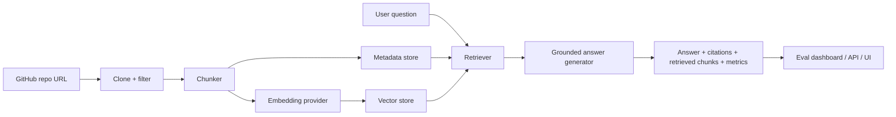

# RepoLens AI

[RepoLens AI](https://repolens-frontend-jbcqjymb5a-uc.a.run.app/) is a full-stack repository Q&A assistant. It indexes a GitHub repo, chunks and stores code with line numbers, retrieves relevant context with hybrid search, and answers questions with grounded citations.

<video src="assets/repolens-demo.mp4" controls="controls" style="max-width: 100%;">
</video>

## Features

- Index public GitHub repositories or local fixtures
- Filter large, generated, and binary files before ingestion
- Chunk code with sliding-window and symbol-aware strategies
- Generate embeddings through a provider interface
- Retrieve with vector, BM25, or hybrid search
- Return answers with exact file and line citations
- Run eval sets with Recall@K, MRR, groundedness, hallucination rate, latency, and cost tracking
- Inspect results in a FastAPI backend and React frontend

## Architecture



## Stack

- Backend: FastAPI, Pydantic, SQLite, optional ChromaDB, sentence-transformers, Gemini/Vertex hooks
- Frontend: React, TypeScript, Vite
- Retrieval: vector, BM25, hybrid, heuristic reranking
- Ops: structured logs, request IDs, `/metrics`, Docker, GitHub Actions

## Project Layout

```text
backend/
  repolens/
    api/
    core/
    services/
  tests/
frontend/
  src/
evals/
fixtures/
docs/
```

## Quickstart

### 1. Install dependencies

```bash
make setup
```

### 2. Run the local verification suite

```bash
make test
make eval
```

### 3. Start the app

```bash
make backend-dev
```

In a second terminal:

```bash
make frontend-dev
```

Open:

- Frontend: `http://localhost:5173`
- Backend: `http://localhost:8000`
- Health: `http://localhost:8000/health`
- Metrics: `http://localhost:8000/metrics`

Question examples and prompt patterns:

- [docs/example-questions.md](docs/example-questions.md)

## Default Local Mode

The default setup is local and free:

- `EMBEDDING_PROVIDER=hashing`
- `VECTOR_STORE_PROVIDER=memory`
- `ANSWER_PROVIDER=extractive`

You only need Gemini or Vertex credentials if you explicitly switch to cloud-backed providers.

## API

### Index a repository

```bash
curl -X POST http://localhost:8000/api/repos/index \
  -H "Content-Type: application/json" \
  -d '{"repo_url":"https://github.com/openai/openai-cookbook"}'
```

### Query an indexed repository

```bash
curl -X POST http://localhost:8000/api/query \
  -H "Content-Type: application/json" \
  -d '{"repo_id":"REPO_ID","question":"Where is the main entrypoint?","retrieval_mode":"hybrid","top_k":6}'
```

## Evaluation

Eval sets live in `evals/` and can be run through the UI or CLI:

```bash
python -m repolens.eval --repo-id <id> --eval-set evals/sample_eval.json
```

Included eval fixtures:

- `evals/sample_eval.json`
- `evals/code_spa_readme_eval.json`
- `evals/code_spa_impl_eval.json`

The evaluation dashboard reports:

- Recall@3 and Recall@5
- MRR
- Answer match score
- Groundedness
- Hallucination rate
- Average and p95 latency
- Average cost per query
- Failure rate and failed items

## Eval Snapshot

Latest local free-mode run on the bundled sample fixture (`fixtures/sample_repo`) with:

- `EMBEDDING_PROVIDER=hashing`
- `VECTOR_STORE_PROVIDER=memory`
- `ANSWER_PROVIDER=extractive`

| Metric | Result |
| --- | --- |
| Recall@3 | `1.00` |
| Recall@5 | `1.00` |
| MRR | `1.00` |
| p95 latency | `3 ms` |
| Avg cost/query | `$0.0000` |

## Supported Files

RepoLens currently indexes:

- `.py`, `.ts`, `.tsx`, `.js`, `.jsx`
- `.java`, `.rb`, `.go`, `.cpp`, `.h`
- `.md`, `.yml`, `.yaml`, `.json`

It skips common generated or low-value paths such as `.git`, `node_modules`, `dist`, `build`, `target`, `.next`, `vendor`, binaries, images, and oversized files.

## Deployment

- Local Docker workflow: `make docker`
- Docker Compose: `docker-compose up --build`
- Cloud Run notes: [docs/deploy-cloud-run.md](docs/deploy-cloud-run.md)

## Notes

- Public GitHub repos are cloned into `.data/repos` during indexing and cleaned up after processing.
- The cheap Cloud Run path is demo-grade: repo indexes live in `.data/` and are not durable across backend restarts.
- The personal Cloud Run backend build uses the base dependency set; optional parser and provider integrations stay in local/dev installs unless you rebuild with extras.
- Re-index a repo after changing chunking or retrieval behavior if you want the new indexing strategy to apply to stored chunks.
